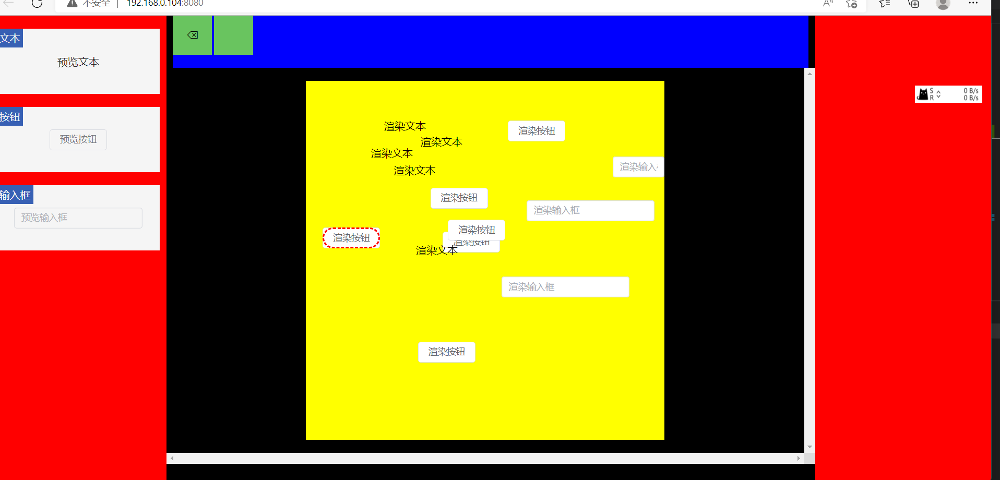

<a name="readme-top"></a>
[![LinkedIn][linkedin-shield]][linkedin-url]


<!-- PROJECT LOGO -->
<br />
<div align="center">
  <a href="https://github.com/othneildrew/Best-README-Template">
    
  </a>

  <h3 align="center">A TodoList Proj plus others</h3>

  <p align="center">
    第一次提交，以后还要修改
    <br />
    <a href="https://github.com/logwood/proh"><strong>Explore the docs »</strong></a>
    <br />
    <br />
    <a href="https://github.com/logwood/proh">View Demo</a>
    ·
    <a href="https://github.com/logwood/proh/issues">Report Bug</a>
    ·
    <a href="https://github.com/logwood/proh/issues">Request Feature</a>
  </p>
</div>


<!-- TABLE OF CONTENTS -->
<details>
  <summary>Table of Contents</summary>
  <ol>
    <li>
      <a href="#about-the-project">About The Project</a>
      <ul>
        <li><a href="#built-with">Built With</a></li>
      </ul>
    </li>
    <li>
      <a href="#getting-started">Getting Started</a>
      <ul>
        <li><a href="#prerequisites">Prerequisites</a></li>
        <li><a href="#installation">Installation</a></li>
      </ul>
    </li>
    <li><a href="#usage">Usage</a></li>
    <li><a href="#roadmap">Roadmap</a></li>
    <li><a href="#contributing">Contributing</a></li>
    <li><a href="#license">License</a></li>
    <li><a href="#contact">Contact</a></li>
    <li><a href="#acknowledgments">Acknowledgments</a></li>
  </ol>
</details>


<!-- ABOUT THE PROJECT -->
## About The Project



本来要做拖拽的，结果做着做着就越来越像文本编辑器，不知道能不能继续顺着做下去:cry:


Use the `README.md` to get started.

<p align="right">(<a href="#readme-top">back to top</a>)</p>


### Built With


* [![React][React.js]][React-url]
* [![Vue][Vue.js]][Vue-url]
* [![JQuery][JQuery.com]][JQuery-url]

<p align="right">(<a href="#readme-top">back to top</a>)</p>


<!-- GETTING STARTED -->
## Getting Started

This is an example of how you may give instructions on setting up your project locally.
To get a local copy up and running follow these simple example steps.

### Prerequisites

This is an example of how to list things you need to use the software and how to install them.
* npm
  ```sh
  npm install npm@latest -g
  ```

### Installation

_Below is an example of how you can instruct your audience on installing and setting up your app. This template doesn't rely on any external dependencies or services._

1. Get a free API Key at [https://example.com](https://example.com)
2. Clone the repo
   ```sh
   git clone https://github.com/logwood/proh.git
   ```
3. Install NPM packages
   ```sh
   npm install
   ```
4. run and view proj
   ```sh
   npm run serve
   ```


<!-- ROADMAP -->
## Roadmap

- [ ] todolist
    - [ ] 能够添加和删除待办项
    - [ ] 能够切换待办项的完成状态（完成至未完成、未完成至完成）
    - [ ] 点击待办项能够以弹窗的形式显示具体信息
    - [x] 能够可持久化储存ToDoList
    - [x] 使用框架来构建项目
    - [ ] 使用ECMAScript 6或者TypeScipt来处理交互
    - [ ] 使用Electron打包项目
    - [ ] 具有适当的过渡动画
    - [x] 可以拖拽代办项进行排序（不使用组件库为优）
- [X] 娱乐题
    - [X] three.js
        - [X] 使用Three.js加载并渲染一.ply格式的点云文件；
        - [X] 使用射线拾取功能侦测点击位置，并在点击位置渲染一红球。
        - [ ] 对巨大的点云数据进行降采样；
        - [ ] 分片加载
        - [ ] Response time in man-computer conversational transactions
        - [ ] 小地图显示
        - [ ] 战争迷雾
    - [x] 初探WebAssembly
        - [X] 编写一文件，在控制台输出使用WebAssembly技术的代码和纯JavaScript代码实现相同功能的运行时间对比。
        - [X] 提供一个简单的HTTP服务，用来返回.wasm文件；并在页面中请求此文件，且使用流式编译技术。


<p align="right">(<a href="#readme-top">back to top</a>)</p>

## License

Distributed under the MIT License. See `LICENSE.txt` for more information.

<p align="right">(<a href="#readme-top">back to top</a>)</p>
<!-- CONTACT -->
## Contact

My Name - @wangsang - 9990928@qq.com

Project Link: [https://github.com/logwood/prog/](https://github.com/logwood/prog)

<p align="right">(<a href="#readme-top">back to top</a>)</p>


<!-- MARKDOWN LINKS & IMAGES -->
<!-- https://www.markdownguide.org/basic-syntax/#reference-style-links -->
[contributors-shield]: https://img.shields.io/github/contributors/othneildrew/Best-README-Template.svg?style=for-the-badge
[contributors-url]: https://github.com/logwood/prog/graphs/contributors
[forks-shield]: https://img.shields.io/github/forks/othneildrew/Best-README-Template.svg?style=for-the-badge
[forks-url]: https://github.com/logwood/prog/network/members
[stars-shield]: https://img.shields.io/github/stars/othneildrew/Best-README-Template.svg?style=for-the-badge
[stars-url]: https://github.com/logwood/prog/stargazers
[issues-shield]: https://img.shields.io/github/issues/othneildrew/Best-README-Template.svg?style=for-the-badge
[issues-url]: https://github.com/logwood/prog/issues
[license-shield]: https://img.shields.io/github/license/othneildrew/Best-README-Template.svg?style=for-the-badge
[license-url]: https://github.com/logwood/prog/blob/master/LICENSE.txt
[linkedin-shield]: https://img.shields.io/badge/-LinkedIn-black.svg?style=for-the-badge&logo=linkedin&colorB=555
[linkedin-url]: https://github.com/logwood/prog
[product-screenshot]: images/screenshot.png
[Next.js]: https://img.shields.io/badge/next.js-000000?style=for-the-badge&logo=nextdotjs&logoColor=white
[Next-url]: https://nextjs.org/
[React.js]: https://img.shields.io/badge/React-20232A?style=for-the-badge&logo=react&logoColor=61DAFB
[React-url]: https://reactjs.org/
[Vue.js]: https://img.shields.io/badge/Vue.js-35495E?style=for-the-badge&logo=vuedotjs&logoColor=4FC08D
[Vue-url]: https://vuejs.org/
[Angular.io]: https://img.shields.io/badge/Angular-DD0031?style=for-the-badge&logo=angular&logoColor=white
[Angular-url]: https://angular.io/
[Svelte.dev]: https://img.shields.io/badge/Svelte-4A4A55?style=for-the-badge&logo=svelte&logoColor=FF3E00
[Svelte-url]: https://svelte.dev/
[Laravel.com]: https://img.shields.io/badge/Laravel-FF2D20?style=for-the-badge&logo=laravel&logoColor=white
[Laravel-url]: https://laravel.com
[Bootstrap.com]: https://img.shields.io/badge/Bootstrap-563D7C?style=for-the-badge&logo=bootstrap&logoColor=white
[Bootstrap-url]: https://getbootstrap.com
[JQuery.com]: https://img.shields.io/badge/jQuery-0769AD?style=for-the-badge&logo=jquery&logoColor=white
[JQuery-url]: https://github.com/logwood/prog 
